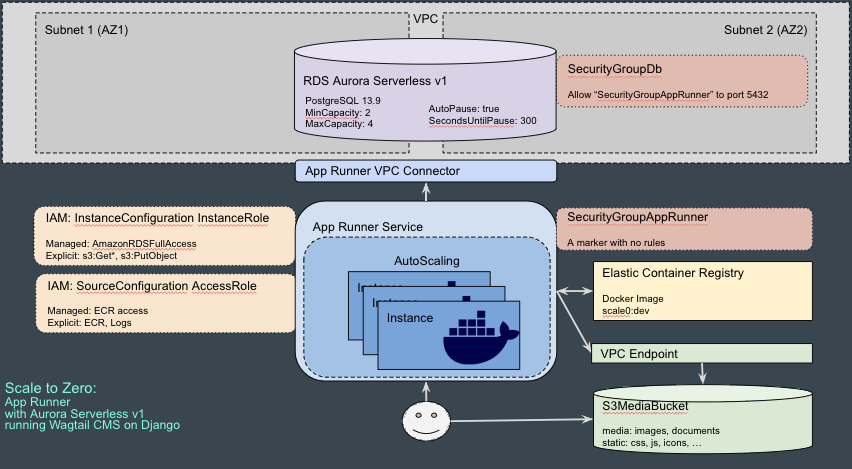
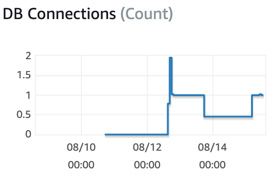
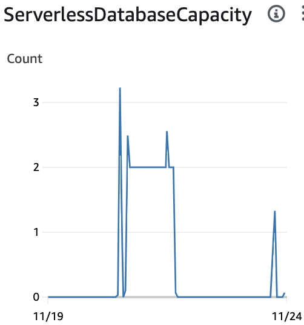
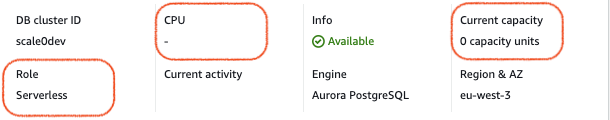
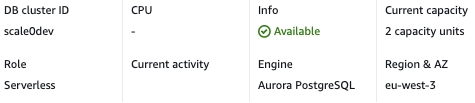
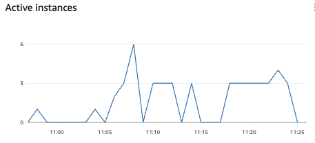
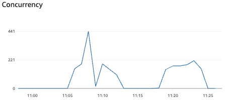
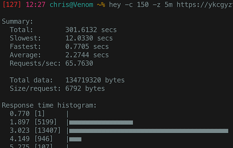
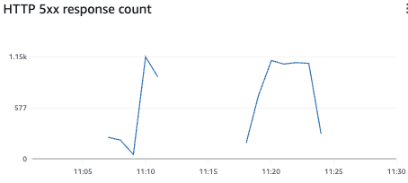

========================================================
 Wagtail CMS on App Runner with Aurora Serverless v1 DB
========================================================

AWS `App Runner <https://aws.amazon.com/apprunner/>`_ is ideally
suited for running pure HTTP apps that don't need all the features
that `Fargate <https://aws.amazon.com/fargate/>`_ provides. The config
is much simpler, it auto-scales based on demand, and it includes its
own load balancer. As of February 2022, it can access things in a VPC,
so we can have our app persist to an RDS database including Aurora
serverless. See:

* Excellent blog post comparing simplicity and cost: `Fargate vs. App
  Runner <https://cloudonaut.io/fargate-vs-apprunner/>`_
* Live Coding video: `Migrating from ECS and Fargate to AWS App Runner
  <https://www.youtube.com/watch?v=ABvx7radhw4>`_
* AWS App Runner `FAQs <https://aws.amazon.com/apprunner/faqs/>`_

Both App Runner and `Aurora Serverless v1
<https://docs.aws.amazon.com/AmazonRDS/latest/AuroraUserGuide/Concepts.Aurora_Fea_Regions_DB-eng.Feature.ServerlessV1.html>`_
can scale to zero to save money on sites that aren't used 24x7. When
requests subside, App Runner saves the state to RAM to allow instant
restart, and charges about 1/10th the cost of running with CPU. When
Aurora Serverless v1 sleeps, it takes about 30 seconds to wake up.

This code deploys a stock `Wagtail CMS <https://wagtail.org/>`_ (based
on `Django <https://www.djangoproject.com/>`_) with PostgreSQL DB and
S3 storage for media. We're not trying to demo a full-blown Wagtail
app here, just using the out-of-box experience to demonstrate
scalability of a sophisticated CMS

The `<DEVELOPMENT.rst>`_ describes how to get it running, so this
README will focus on high-level topics. `<TROUBLESHOOTING.rst>`_ gives
some hard-won lessons learned, while `<QUESTIONS_CAUTIONS.rst>`_ has
some gotchas, and `<TODO.rst>`_ is a grab bag of things that might be
worth improving.

(As of 2023-11-14, App Runner was not listed as FedRAMP certified, so
we are not able to us it for our US Government projects yet.)

Architecture
============

Aurora is RDS, and RDS needs to be deployed into a VPC. I created a
VPC with two Public Subnets so I don't have to run APIGW and incur
it's $70/month cost. A `VpcConnector
<https://docs.aws.amazon.com/apprunner/latest/api/API_VpcConnector.html>`_
is used to allow App Runner access to RDS. Security Groups restrict
access to the DB, while IAM roles allow App Runner to access ECR,
Logs, and S3.

There's an S3 bucket for Wagtail media (images, documents) and static
resources (e.g., css, js). I found I had to create a `VPC Endpoint
<https://www.alexdebrie.com/posts/aws-lambda-vpc/>`_ for App Runner to
be able to access this. Our stateless service uses `Django Storages
<https://django-storages.readthedocs.io/en/latest/>`_ is used to
read/write S3 objects; interestingly, it uses presigned URLs to access
these resources, so we don't need to give our objects public-read
access.

The developer creates a Docker image with Wagtail and uploads to
`Elastic Container Registry (ECR) <https://aws.amazon.com/ecr/>`_. App
Runner will see new images and deploy them automatically. Once the
health check probe is successful, it directs traffic to the new service
instance instead of the old.

Scaling
=======

We run Aurora Serverless v1 because it can scale to zero capacity, and
App Runner because it scales to zero running instances (pay only for
RAM). This should save us money, especially on development or other
low-use environments. They both scale up based on their configurations
to handle load.

RDS Aurora Serverless v1
------------------------

Our goal is to reduce cost by scaling to zero. AWS RDS Aurora
Serverless v1 does this natively: if no connections are seen for some
time, it pauses the DB. When a connection comes in, it spins it back
up.

We create our Aurora DB in the ``db.yaml`` file, and specify a
5-minute pause timeout::

  ScalingConfiguration:
    AutoPause: true
    MaxCapacity: 4
    MinCapacity: 2
    SecondsUntilAutoPause: 300

Aurora PostgreSQL-13.9 config page shows::

  Autoscaling timeout: 5 minutes
  Pause compute capacity after consecutive minutes of inactivity: 5 minutes

We can see pause/resume events::

  November 15, 2023, 18:18 The DB cluster is being paused.
  November 15, 2023, 18:19 The DB cluster is paused.
  November 15, 2023, 18:41 The DB cluster is being resumed.
  November 15, 2023, 18:42 The DB cluster is resumed.
  November 15, 2023, 18:48 Scaling DB cluster from 2 capacity units to
                           4 capacity units for this reason: Autoscaling.
  November 15, 2023, 18:48 The DB cluster has scaled from 2 capacity
                           units to 4 capacity units.

Under the Databases "Monitoring" tab we can see graphs showing DB Connections and
Serverless Database Capacity (these are over different time periods):

And over time we can watch the top level status showing scaled to zero:

then resume:

App Runner
----------

The "Auto scaling" section of the App Runner > Services > scale0-dev >
Configuration shows::

  Name:              DefaultConfiguration
  Revision number:   1
  Concurrency:     100
  Minimum size:      1
  Maximum size:     25

It will accept 100 concurrent requests before scaling up, to a maximum
of 25 instances. This should be fine.

We could create an `auto scaling configuration
<https://docs.aws.amazon.com/AWSCloudFormation/latest/UserGuide/aws-resource-apprunner-autoscalingconfiguration.html>`_
and reference it by ARN in the App Runner config but it's not
necessary for this test now.

We currently ensure that Wagtail doesn't leave a persistent connection
to the database. The `Django Databases docs
<https://docs.djangoproject.com/en/4.1/ref/databases/>`_ say:

  Persistent connections avoid the overhead of reestablishing a
  connection to the database in each request. They’re controlled by
  the CONN_MAX_AGE parameter which defines the maximum lifetime of a
  connection.

  The default value is 0, preserving the historical behavior of
  closing the database connection at the end of each request. To
  enable persistent connections, set CONN_MAX_AGE to a positive
  integer of seconds.

  [...] The development server creates a new thread for each request
  it handles, negating the effect of persistent connections. Don’t
  enable them during development.

We're not specifying ``CONN_MAX_AGE`` so should not have persistent
connections; we're also currently running the development server,
which does not persist.

The App Runner "Metrics" tab displays at the bottom the number of active
instances, in this case showing scale up and down during load testing:

It also shows the number of concurrent connections:

So we can conclude App Runner is scaling to zero as desired, and
scales up to handle increased request concurrency.

Load Testing
------------

If we can run a load tester against it that submits over 100
concurrent requests, we should see it scale.

I can use the simple `hey <https://github.com/rakyll/hey>`_ tool to
load test. The following runs for 1 minute, with a concurrency of 150::

  hey -c 150 -z 1m https://ykcgyztfmf.eu-west-3.awsapprunner.com/

When I ran this, I watched the Concurrency and Instances grow in the
AWS console (above) but we also saw 500 errors from App Runner:

The app logs said::

 FATAL: remaining connection slots are reserved for non replicate
 superuser connections

I believe this indicates we've run out of PostgreSQL connections. See
the `<TODO.rst>`_ section about enabling persistent connections. I
don't know if we would get more if we waited for Aurora to scale up
the service, or if we have to increase the pool size in the DB
configuration.

Verdict
=======

App Runner scales to zero, costing only the RAM at about $0.01/hour.
Aurora Serverless v1 scales to zero, so we only pay for the data
storage.

Estimated total cost for both, when active for a 8 hour/day and 5
days/week, is under $30: cheap enough that every developer can have
their own.

For production environments, App Runner should be fine too, but we'd
probably want to look at Aurora Serverless v2 to avoid cold start
delays and scale faster.
